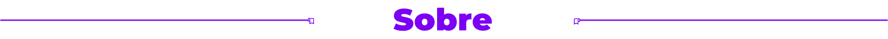
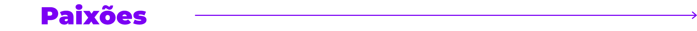
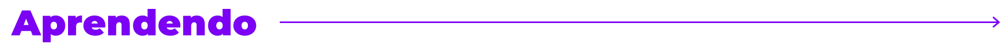
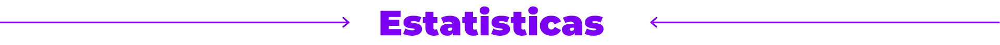
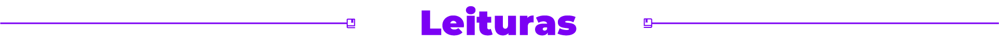
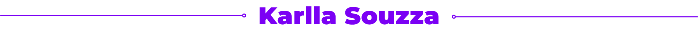

  

 

Sou uma mulher transexual gosto muito de seguir o meu coração, eu sou apaixonada por programação web, web design e principalmente VueJs; Costumo ler livros e gosto de escrever documentos para ajudar as pessoas no desenvolvimento web com JavaScript(ecmaScript). Meu primeiro contato com programação foi em janeiro de 2020 na faculdade, desde então venho aprofundando meus conhecimentos e expandindo para o design entre outras áreas. 
Luto por uma web para todos e contra todo e qualquer tipo de preconceito dentro e fora da web. 

 
 

  

 

- Músicas 🎶;
- Ensinar web design ✒️;
- Ensinar programação web 💻;
- Ler livros 📚;
- Lutar contra todo e qualquer preconceito 🌈;
- Lutar por uma web para todos ♿.

 
 

  

- Html5
- Css3
- JavaScript
- VueJs / Nuxt
- PHP / Laravel 
- Modelagem de banco de dados Sql
- WordPress / Elementor
- Web Design / Design para plataformas
- React / React Native

 
 

  

 

 
 

  

 

- Design Para Quem Não É Designer;
- O Design Do Dia Dia.

 
 

  

 

